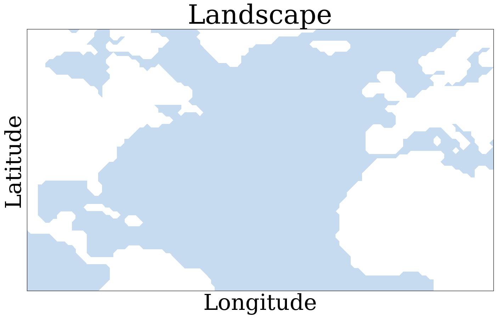
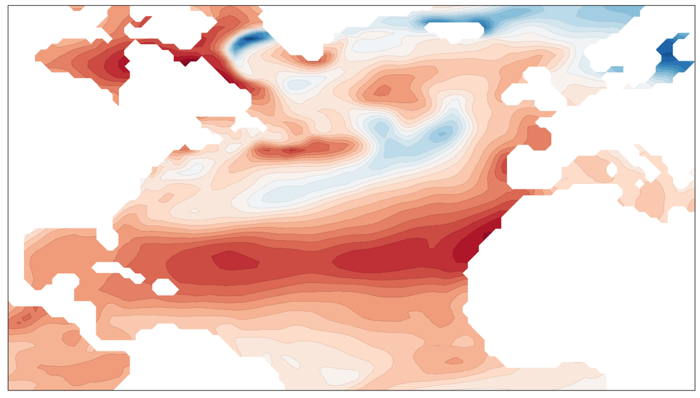
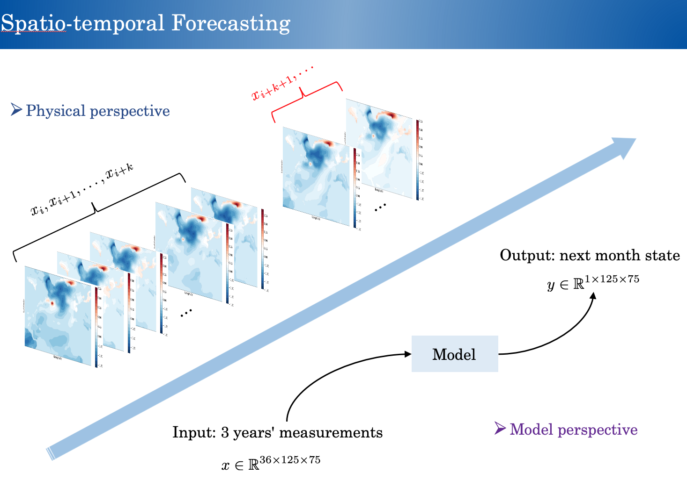

# Near-Term-Climate-Prediction-BDL

<p><p>

## Associated Papers
Feature Importance in a Deep Learning Climate Emulator [ [ArXiV](https://arxiv.org/abs/2108.13203) ] [ [ICLR 2021 Workshop on Modeling Oceans and Climate Change](https://iclr.cc/virtual/2021/workshop/2123) ]
A Bayesian Deep Learning Approach to Near-Term Climate Prediction [ [ArXiV](https://arxiv.org/abs/2202.11244) ] [ [Journal of Advances in Modeling Earth Systems](https://arxiv.org/abs/2202.11244) ]

[Xihaier Luo](https://xihaier.github.io/), Balasubramanya T Nadiga, Yihui Ren, Ji Hwan Park, Wei Xu, Shinjae Yoo


## Dependencies
- python 3
- PyTorch
- matplotlib


## Installation

- Install PyTorch and other dependencies

- Clone this repo:

```
git clone https://github.com/Xihaier/Near-Term-Climate-Prediction-BDL
```


## Dataset

The dataset used have been uploaded to Google Drive and can be downloaded with corresponding links.

Link: https://drive.google.com/file/d/1WvzLWcXRvXOXfAk_mqaMAWXxwBhGy8hE/view?usp=sharing


## Model
<p><p>
  
We ran extensive models and shared some of the best ones here, which can be divided into two categories: deterministic models and Bayesian models. For example, if a deterministic model, such as DenseNet, is chosen, one should run 

```bash
cd src
python main_DL.py
```

If you are interested in ConvLSTM and its variants, we have included our implementation in the appendix folder.

```bash
cd appendix
python main.py
```

## Citation

If you find this repo useful for your research, please consider to cite:

```latex
@article{luo2022bayesian,
  title={A Bayesian Deep Learning Approach to Near-Term Climate Prediction},
  author={Luo, Xihaier and Nadiga, Balasubramanya T and Ren, Yihui and Park, Ji Hwan and Xu, Wei and Yoo, Shinjae},
  journal={arXiv preprint arXiv:2202.11244},
  year={2022}
}
```

## Questions

For any questions or comments regarding this paper, please contact Xihaier Luo via [xluo@bnl.gov](mailto:xluo@bnl.gov).

